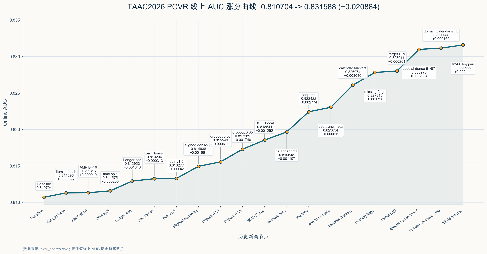

# TAAC2026 PCVR 方案复盘

这个仓库是 TAAC2026 腾讯广告算法大赛学术赛道的一个 PCVR
方案。任务是点击后转化率预测：给定用户特征、目标 item 特征，以及
四个行为序列 domain，预测该点击样本是否会转化。训练标签来自
`label_type == 2`。

本项目从官方 baseline 出发，经过多轮特征工程、训练稳定性优化和模型
结构消融，最终线上最好成绩为：

```text
AUC: 0.831588
分支: codex/log-pair-6266-v1
提交: ad88c74
评估任务: 修改62-66pair epoch5_eval_1779544640
```

## 涨分曲线



## 目录结构

```text
.
├── run.sh              # 官方训练平台入口脚本
├── train.py            # 参数解析、数据集、模型和 trainer 构建
├── dataset.py          # Parquet IterableDataset 与特征工程
├── model.py            # PCVRHyFormer 模型、序列编码器、tokenizer
├── trainer.py          # 训练循环、验证、EMA、checkpoint 保存
├── utils.py            # 日志、随机种子、loss、工具函数
├── eval/
│   ├── infer.py        # 官方评估平台推理入口
│   ├── dataset.py      # 评估侧数据代码副本
│   └── model.py        # 评估侧模型代码副本
├── ns_groups.json      # 可选 NS 语义分组配置示例
└── AGENTS.md           # 项目背景、平台约束和实验上下文
```

完整比赛训练数据不包含在仓库中。本地如果存在 `demo_1000.parquet`，它只是
官方提供的格式/demo 数据集，不代表完整训练集，并且被 git 忽略。

## 最终主线配置

当前 `run.sh` 对应最终 best 风格配置，主要包括：

- RankMixer NS tokenizer。
- Longer sequence encoder。
- 序列长度：`seq_a:256, seq_b:256, seq_c:1024, seq_d:1024`。
- 按 row group 时间中位数做验证集切分。
- AMP BF16 训练。
- Dense-only EMA。
- 每个 epoch 保存 checkpoint。
- BCE + focal blend loss。
- Target DIN 分支。
- 特征工程：
  - pair features；
  - calendar/time features；
  - sequence time features；
  - sequence truncation summary；
  - missing indicator；
  - aligned dense-int pair tokens。

最终最关键的特征改动是：只对 user feature id `62-66` 做 aligned
dense-int pair，并对 dense 权重做 `log1p` 变换；`89-91` 不再进入 pair
路径，而是保留在 raw dense 中。这个改动对应当前最高线上 AUC `0.831588`。

## 研究路径复盘

这次比赛基本是从官方 baseline 一点点往上摸。最开始并没有很清楚的路线，
更多是在看每次实验掉在哪里、哪些信息 baseline 没表达出来，然后围绕这些
缺口补模块。

回头看，真正涨分的点大多不是“大模型结构”，而是把数据里的语义讲清楚：
target item 和历史行为怎么对应、dense 和 int 哪些是配对的、时间该怎么进
序列 token、哪些 dense 字段不能当普通 dense 处理。

### 1. 训练与序列基座

官方 baseline 线上 AUC 是 `0.810704`。刚开始先做的是比较基础的工程和结构
尝试，主要是想确认：是不是 baseline 训练方式或者序列长度限制了效果。

- 加入 NS output fusion，让最终输出显式融合 NS token 上下文。
- 使用 timestamp row-group split，让验证切分更接近时间外推场景。
- 开启 AMP BF16 和 epoch checkpoint，提升训练效率并便于选择不同 epoch。
- 将序列编码器切到 Longer，并扩大部分序列长度。

这一阶段最高到 `0.8129` 左右。它给我的感觉是：长序列确实有信息，但只是
换 Longer、拉长序列，收益不会特别大。后面想继续涨，还是得让模型看到更
明确的业务关系。

### 2. Target Item 与历史序列 Pair

第一个比较明确 work 的方向是 target item 和用户历史序列的 pair。PCVR 里
很自然会关心：当前这个 item 的某些属性，用户以前有没有在某个 domain 里
见过。

- target item 某个 fid 是否在历史序列中出现；
- 出现次数；
- 最近一次出现距离当前样本多久；
- 最近 20/100 条行为里是否出现。

所以加了 item-history pair dense features，线上到 `0.8132` 左右。这个
涨幅不算夸张，但很重要，因为它说明：有些 target-history 关系最好显式做
出来，不能全交给序列模型自己悟。

### 3. Dense-Int 对齐语义

后面开始看 dense/int 的关系，发现有些 `user_dense` 和 `user_int` 是同 fid
对齐的。这类特征如果只是把 dense 全部 concat 后 linear，会损失很多结构。
它更像：

```text
user_int:   一组 id
user_dense: 对应 id 的数值/权重
```

于是做了 aligned dense-int tokenizer，用 dense value 去加权对应 int id 的
embedding。这个方向把线上推到 `0.817+`，算是第一次比较明显地感受到：
这题的涨分点很大一部分在“理解字段语义”。

### 4. Loss 与基础时间特征

有了 aligned dense-int 之后，又调了一版比较稳的训练配置：

- `dropout_rate=0.05`
- BCE + focal blend，`focal_blend_weight=0.3`
- `focal_alpha=0.5`
- `focal_gamma=1.0`

然后开始补时间特征：样本级 calendar/time、序列级时间 summary、截断长度、
calendar sparse bucket。这个阶段线上逐步到 `0.826+`。

当时的直觉是：广告行为里的真实时间很重要，光靠序列相对位置不够。比如
小时、星期、最近行为距离现在多久，这些都不是普通位置编码能直接表达好的。

但这个方向后面也踩了坑。时间特征不是越多越好，session、shift、gap、复杂
窗口这些继续叠，很多时候会和已有的 recency/span/calendar 重复，线上反而
掉分。

### 5. Missing Indicator

另一个比较稳的点是 missing indicator。很多字段缺失、无效、list 太短，本身
就可能有标签倾向。所以加了简单的 binary flag，告诉模型 `user_int`、
`item_int`、`user_dense` 哪些地方缺失或无效。

这一版线上到 `0.827810`。

后面也试过更细的 typed missing、missing sparse bucket，但没有继续稳定涨。
所以这里的结论比较朴素：缺失状态有用，但别拆太碎。

### 6. Target DIN

DIN 也是一个有用但没想象中大的点。我们在强特征基座上加了轻量 target-aware
DIN，让 target item 对历史序列做 attention，再把结果作为输出侧 residual
context。

这一版到 `0.828011`，后面去掉 DIN 掉到 `0.826212`。

所以 DIN 肯定有贡献，但不是最大涨分点。可能是因为 pair、time、aligned
dense-int 已经显式给了很多 target-aware 信息，DIN 的边际收益就被压缩了。

### 7. Special Dense 61/87

真正带来大跳的一步，是开始更认真地区分 dense 字段。`user_dense` 里的 61
和 87 明显不像普通 dense，尤其 87 可以按 `10 x 32` 的结构 reshape 后单独
pooling。

加入 special dense 61/87 tokenizer 后，线上到 `0.830975`。这一步对后面的
启发很大：不要把所有 dense 都当成一坨连续特征，有些字段是有内部结构的。

### 8. Domain-Aware Sequence Calendar

然后在时间特征上又做了一次更有效的改法：不只是给样本加时间，而是把
event-level calendar 信息加到每个序列 token 上，而且区分 domain：

```text
domain × weekday × hour
```

修正 domain index 后，这一版到 `0.831144`，成为一段时间内的 strong best。
这个点其实很直观：同样是周几几点，发生在不同 domain 的行为里，含义可能
不一样，所以应该进到 sequence token 里。

### 9. 62-66 Log Pair 语义修正

最后的 best 不是来自一个新大模块，而是回到 aligned dense-int 这条线继续
修语义。我们发现 `62-66` 和 `89-91` 不应该用同一套规则处理：

- `62-66` 更像 dense-int 对齐 pair，但 raw dense 数值长尾严重，直接当权重
  容易被极端值支配；
- `89-91` 更像另一类系数/向量，不适合直接作为 int embedding 权重；
- 原始 raw dense 路径不应被破坏。

最终 best 改动为：

```text
62-66: dense weight 使用 log1p 压缩，再做 aligned dense-int pooling
89-91: 不进入 aligned pair，保留在 raw dense 路径
```

对应线上最高 AUC：

```text
0.831588
```

这个实验后验看是最扎实的：最后阶段最有效的不是继续堆新模块，而是修正
已经有效特征路径里的语义错配。

### 总结

从 baseline 到 best 的主线可以概括为：

```text
baseline
→ 稳定训练与长序列
→ target-history pair
→ dense-int 对齐
→ 时间特征
→ missing indicator
→ target DIN
→ special dense 61/87
→ domain-aware sequence calendar
→ 62-66 log pair 语义修正
```

最后总结下来：

- 最大收益来自理解字段语义，而不是盲目加大模型。
- user dense/int 对齐特征和特殊 dense 处理是最关键的涨分来源。
- target-history pair 是简单但有效的 target-aware 交互。
- 时间特征有收益，但复杂 session/shift/gap/window 容易冗余或过拟合。
- DIN 有贡献，但在强特征栈下边际收益有限。
- Transformer、OneTrans、pyramid、tokenizer 顺序调整等结构实验有信息量，
  但没有超过最终 LongerEncoder 主线。

## 官方平台训练

官方训练平台会自动执行根目录下的 `run.sh`。训练代码通过环境变量读取平台
路径，主要包括：

- `TRAIN_DATA_PATH`
- `TRAIN_CKPT_PATH`
- `TRAIN_LOG_PATH`
- `TRAIN_TF_EVENTS_PATH`

提交训练任务时，需要上传根目录的 Python 文件、`run.sh`、必要时的
`ns_groups.json`，以及 `eval/` 目录。

模型 checkpoint 会保存到 `TRAIN_CKPT_PATH`。训练时会同时保存
`train_config.json` 等 sidecar 文件，评估阶段会用这些信息重建完全一致的
模型结构。

## 本地检查

完整训练依赖官方平台数据。本地主要用于语法检查和小规模 smoke test。

常用检查命令：

```bash
python3 -m py_compile train.py trainer.py dataset.py model.py \
    eval/infer.py eval/dataset.py eval/model.py
bash -n run.sh
diff -q dataset.py eval/dataset.py
diff -q model.py eval/model.py
```

如果本地有 demo parquet 和 schema，可以临时改路径跑通流程，但 demo 分数
不能代表线上效果。

## 官方评估

官方评估使用 `eval/infer.py`。推理流程为：

1. 从 `MODEL_OUTPUT_PATH` 读取 checkpoint。
2. 根据 checkpoint 中的 sidecar config 重建模型。
3. 从 `EVAL_DATA_PATH` 读取测试数据。
4. 写出 `${EVAL_RESULT_PATH}/predictions.json`。

输出格式：

```json
{
  "predictions": {
    "user_id": 0.1234
  }
}
```

平台最终展示的评估指标是 AUC。

## 关键 Git 锚点

```text
main                         412a747  官方风格初始 baseline
codex/domain-calendar-emb-v1 6d67b13  强时间特征锚点
codex/dense-ema-v1           81c6181  Dense-only EMA 锚点
codex/log-pair-6266-v1       ad88c74  最终 best 代码锚点
```

当前 best 分支是：

```text
codex/log-pair-6266-v1 @ ad88c74
```

## 注意事项

- `model.py` 与 `eval/model.py` 必须保持同步。
- `dataset.py` 与 `eval/dataset.py` 必须保持同步。
- `eval_scores.csv` 是本地实验记录文件，被 git 忽略。
- `demo_1000.parquet` 是 demo 数据，被 git 忽略。
- 后续如果继续实验，建议从 `codex/log-pair-6266-v1` 拉新分支。
